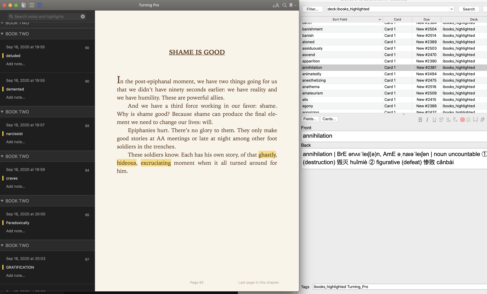

# ibooks_anki

A tool to automate the process of create Anki flashcard from Apple Books __highlighted__ words and got them translated.

### How to:

1. Clone the repo and run `npm install`
2. Install [AnkiConnect](https://github.com/FooSoft/anki-connect) to your Anki, and keep anki client running.
3. Create a deck on your Anki name `ibooks_highlighted`.
3. `npm run start`

### Credits

* AnkiConnect: Expose HTTP API for Anki (https://github.com/FooSoft/anki-connect)
* ibooks-highlights: extract highlighted words from Apple Books Mac OS Client  (https://github.com/solean/ibooks-highlights)
* dictionary.py: A python script to look up words in MacOS dictionary (https://github.com/alichtman/scripts/blob/master/dictionary.py)

### TODO

- [ ] Beautify the output.